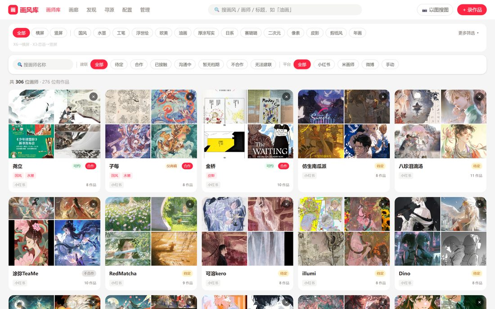
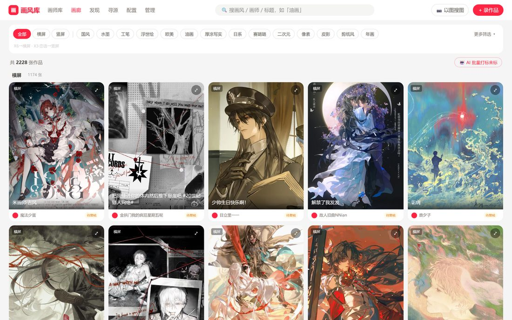
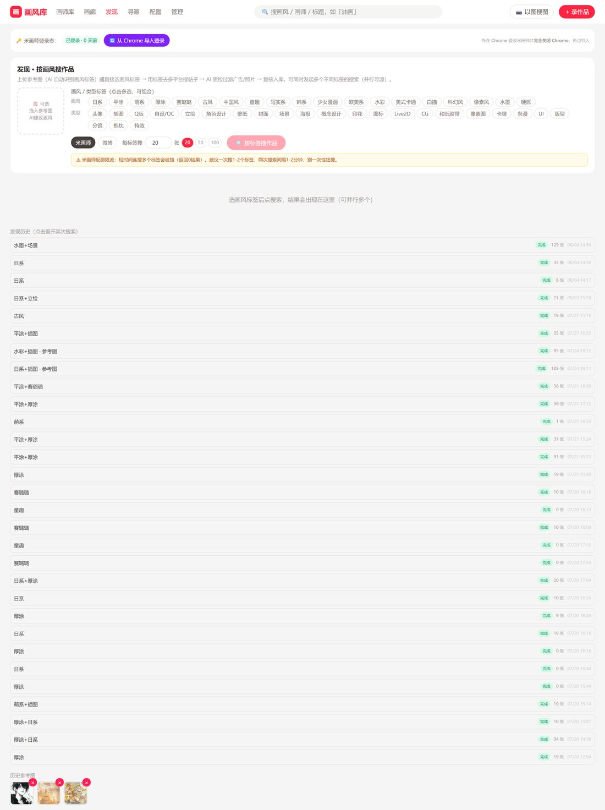
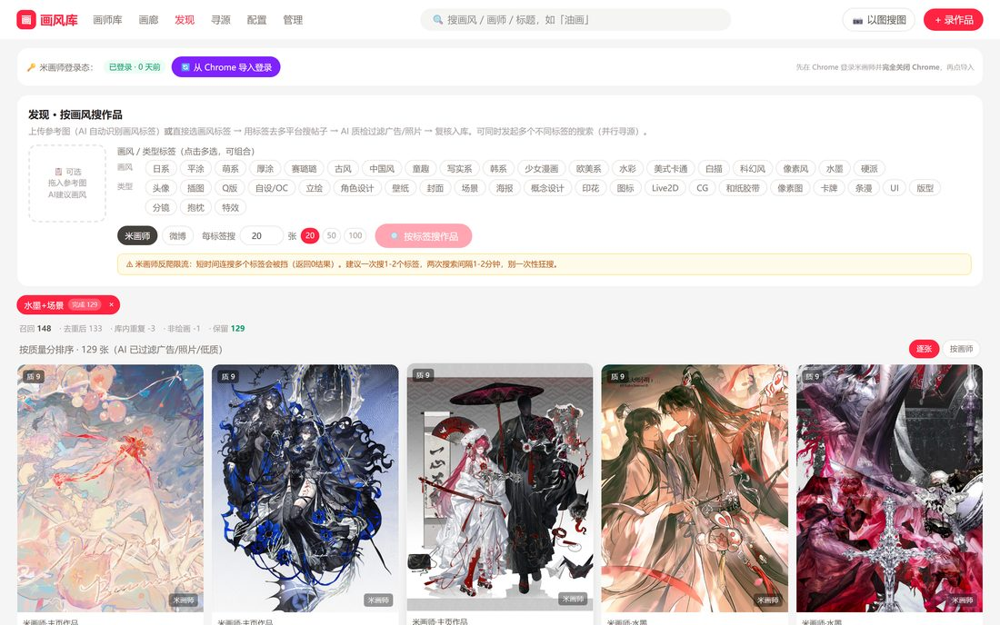
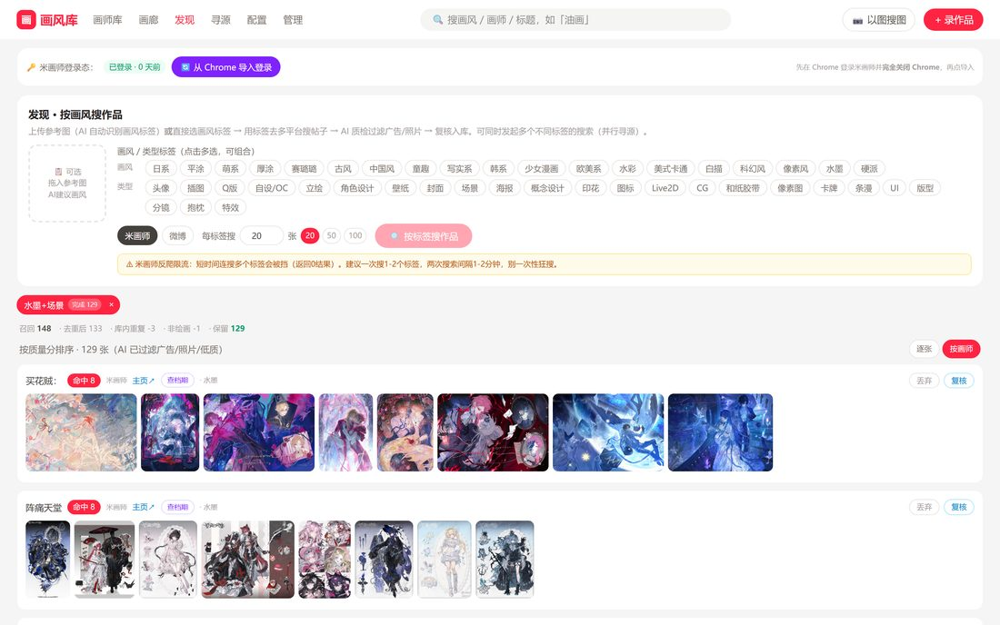
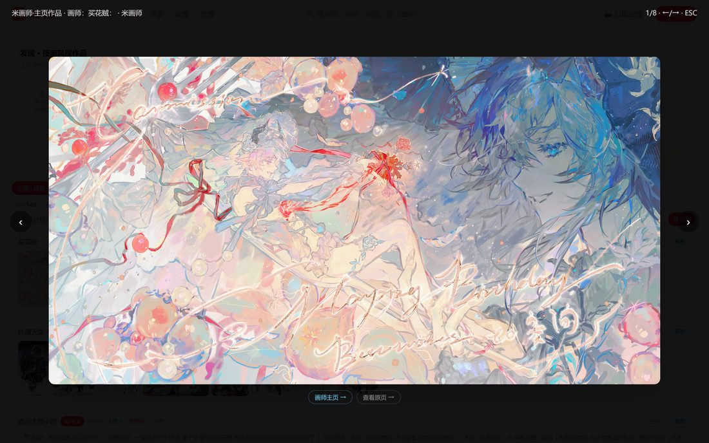
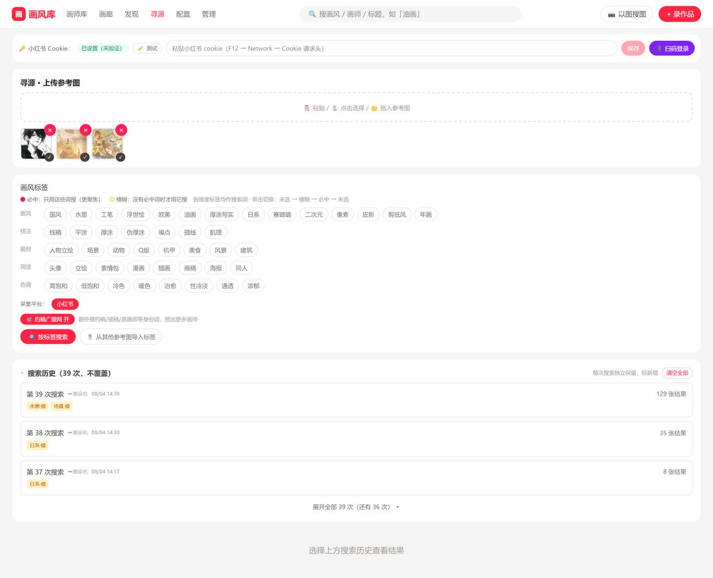
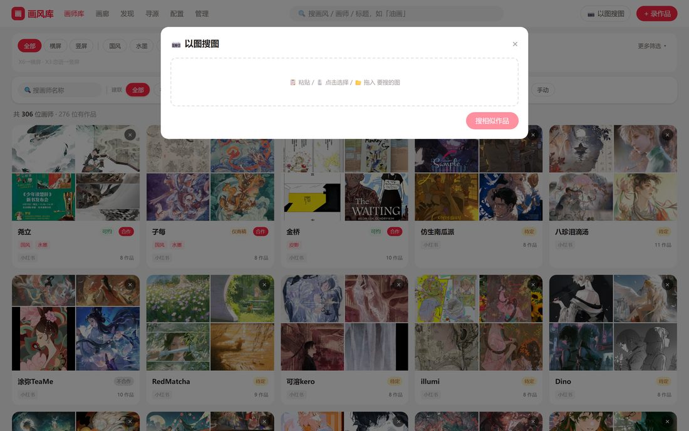
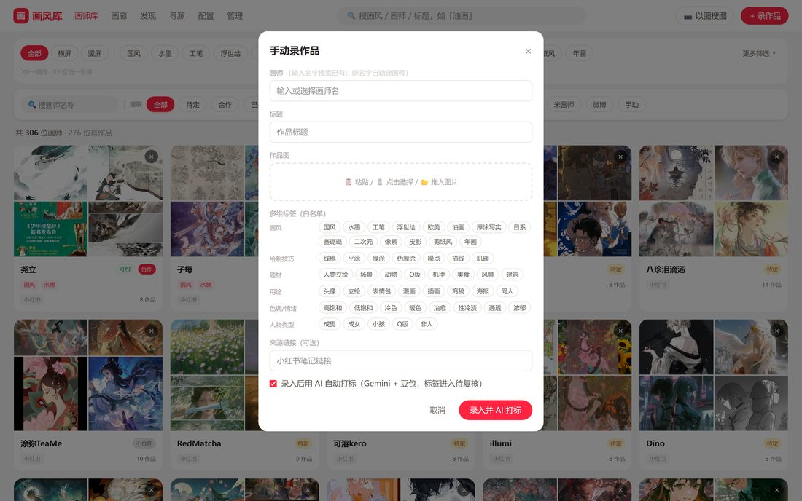
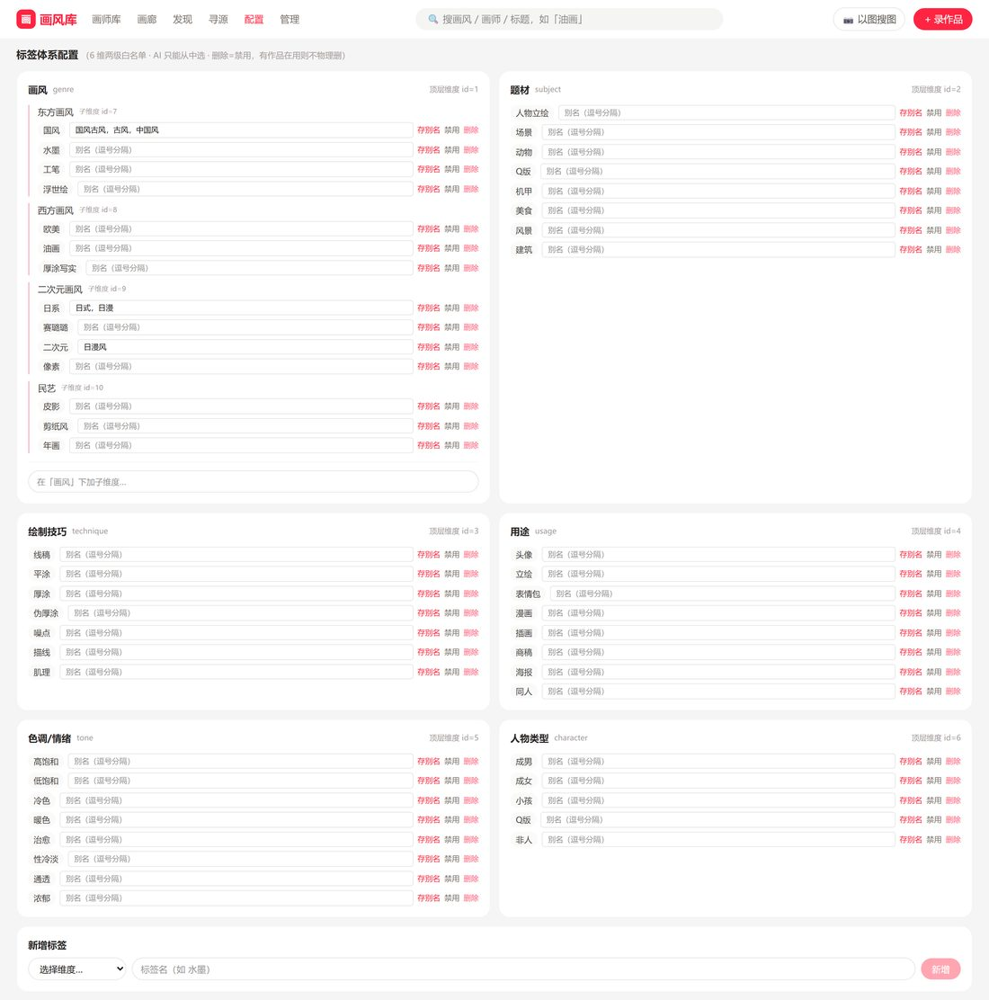

# 画风库 · 使用手册

> 一个「以画风找作品、反查画师、直接建联」的画师资源库。你可以浏览已收录的画师和作品，也可以主动去小红书 / 米画师按画风搜罗新画师，看中了一键入库。
>
> 访问地址：**http://10.10.142.59:3323**（用浏览器打开，建议 Chrome）

---

## 目录

1. [界面总览](#1-界面总览)
2. [画师库：浏览已收录的画师](#2-画师库浏览已收录的画师)
3. [画廊：按画风看作品](#3-画廊按画风看作品)
4. [发现：从米画师按画风搜作品 → 入库](#4-发现从米画师按画风搜作品--入库)
5. [寻源：去小红书按画风找画师 → 建联](#5-寻源去小红书按画风找画师--建联)
6. [以图搜图 / 录作品](#6-以图搜图--录作品)
7. [登录状态（首次必看）与标签配置](#7-登录状态首次必看与标签配置)
8. [常见问题](#8-常见问题)

---

## 1. 界面总览

顶部导航栏贯穿全站，随时可切换功能：

| 入口 | 作用 |
|---|---|
| **画师库** | 已收录画师的名录（首页），按建联状态/平台筛选 |
| **画廊** | 所有作品的瀑布流，按画风标签筛选 |
| **发现** | 去**米画师**按画风搜作品、反查画师、入库 |
| **寻源** | 去**小红书**按画风找画师、抓联系方式、建联 |
| **配置** | 登录状态、标签体系设置 |
| **管理** | 数据维护（进阶） |
| 🔍 搜索框 | 快速搜画风 / 画师名 / 作品标题 |
| 📷 以图搜图 | 上传一张图，找库里画风相似的作品 |
| ＋ 录作品 | 手动录入一件作品 |

> 全站两大主线：**「发现」= 米画师**，**「寻源」= 小红书**。两者都是「按画风搜 → 挑画师 → 入库建联」，入库后就进入**画师库 / 画廊**。

---

## 2. 画师库：浏览已收录的画师

点导航「**画师库**」进入首页。这里是所有已收录画师的卡片名录，每张卡展示画师代表作缩略图、名字、建联状态、作品数。

**你可以：**
- **顶部画风标签**（古风 / 日系 / 水墨 / 油画…）：只看画某种风格的画师。
- **建联状态筛选**（待联系 / 合作中 / 已建联…）：管理你的约稿进度。
- **平台筛选**（小红书 / 米画师…）：只看来自某平台的画师。
- **点任意画师卡** → 进入画师详情页，看其全部作品、编辑联系方式与建联备注。

---

## 3. 画廊：按画风看作品

点导航「**画廊**」。与画师库不同，画廊以**单张作品**为单位铺开，适合「我就想看这种画风的图」。

- 顶部选画风标签即可筛选；
- 点任意作品看大图；
- 每张图可反查它的画师。

---

## 4. 发现：从米画师按画风搜作品 → 入库

「**发现**」用来在**米画师**上按画风批量搜罗作品，再挑出满意的画师入库。这是最稳、最常用的一条线。

### 4.1 发起搜索

> 页面**最顶部**是米画师登录状态，点「**从 Chrome 导入登录**」完成登录——「查档期」和「入库」需要它（详见第 7 节）。

1. **选画风 / 类型标签**：如画风「日系 / 厚涂」、类型「立绘 / 头像」。可多选。
2. **每标签召回数**：默认 20，可调 30 / 50 / 100（越大越慢，也越容易被米画师限流）。
3. 点 **「按标签搜作品」**。搜索在后台跑，量大时要几分钟，**可以离开稍后回来看**。

> ⚠️ 别一次连搜太多标签，容易被米画师限流（表现为「召回 0 张」）。等 1–2 分钟再试。

### 4.2 看结果：逐张 / 按画师两种视图

结果区右上角可切换视图：

**逐张视图**：作品瀑布流，每张图下方直接操作——
- 质量分 / 相似度角标帮你判断；
- 画师↗ 跳米画师主页；
- **复核**（留下）、**丢弃**（不要）；复核后按钮变 **入库**。

**按画师视图**（推荐找画师时用）：把作品按画师归组，一位画师一张卡。

每张画师卡：
- 画师名、命中数、主页↗、画风标签；
- **查档期**：抓这位画师在米画师的接稿档期 / 报价 / 要求（按需点，需登录态）；
- 右侧整组操作：**复核 / 丢弃**，复核后变 **入库建联**（把整位画师连作品一起收进库）；
- **点缩略图看大图**：可用 **‹ ›** 或键盘 **←/→** 翻看这位画师名下的全部作品。

> 大图左右两侧的翻页箭头固定在屏幕边缘；底部可跳「画师主页 / 原页」。

### 4.3 入库两步走

1. **复核**：先把满意的画师/作品从「一级库」挑进「二级库」。
2. **入库建联**：把二级库的画师正式收进画师库（生成画师记录 + 作品）。之后就能在**画师库**里管理它、记录约稿进度。

---

## 5. 寻源：去小红书按画风找画师 → 建联

「**寻源**」用来在**小红书**上按画风找画师。它比发现更进一步：会爬画师主页判断「是不是画师号」，还能抓到**微信 / QQ / 档期**等联系方式。

### 5.1 准备：小红书登录

页面顶部是小红书 Cookie 状态。若显示未登录/过期，点 **📱扫码登录**（弹出二维码，用小红书 App 扫），或粘贴 Cookie 后点保存。**没有登录态会搜不到结果。**

### 5.2 发起寻源

1. （可选）**上传参考图**：系统会自动识别其画风标签。
2. **选画风标签**：支持画风 / 技法 / 题材 / 用途 / 色调 / 人物多维标签，点一下选中。
3. **约稿广撒网**（默认开）：同时用「约稿 / 接稿 / 原画师」等身份词一起搜，能捞到更多在接单的画师。
4. 点 **「按标签搜索」**。

### 5.3 看结果 + 建联

结果按**画师**聚合成卡片，每张卡展示这位画师的代表作、AI 判定的画作占比、画风、以及抓到的**联系方式 / 档期 / 简介**。

每张画师卡可以：
- **丢弃 / 复核** → **入库建联**（两步入库，同发现）；
- **🔍 查米画师同名**：用这位画师的小红书昵称去米画师搜同名账号。找到后会展开候选画师（头像 / 认证 / 接单信誉 / 档期 + 米画师样图），**把米画师作品和左边的小红书代表作对图**，人工确认是不是同一个人——因为撞名不代表就是同一人，所以不会自动关联，由你拍板。

> 底部有**搜索历史**，点任意一次记录可回看当时结果；「继续搜索更多」会在同标签下接着捞没查过的画师。

---

## 6. 以图搜图 / 录作品

**📷 以图搜图**（顶栏）：上传一张参考图，系统按视觉相似度在库里找画风接近的作品。

**＋ 录作品**（顶栏）：手动录入一件作品——填图片、画师、来源等，适合零散补录。

---

## 7. 登录状态（首次必看）与标签配置

### 7.1 登录状态在哪里

发现（米画师）和寻源（小红书）都依赖登录态，**登录态会过期**，过期后会搜不到 / 查不了档期。两个登录入口分别在各自页面顶部，不在「配置」页：

- **小红书登录 → 在「寻源」页顶部**：显示 Cookie 状态，点 **📱扫码登录**（小红书 App 扫码）或粘贴 Cookie 保存。（见第 5.1 节截图）
- **米画师登录 → 在「发现」页顶部**：点「**从 Chrome 导入登录**」或扫码。发现里的「查档期」「入库」依赖它。

> 记住：**搜不到结果 / 查档期失败**，第一件事就是回对应页面顶部看登录态是不是过期了，重登一次即可。

### 7.2 「配置」页 = 标签体系管理（进阶）

导航「**配置**」是**画风标签体系**的管理页，维护画风 / 技法 / 题材 / 用途 / 色调 / 人物各维度下的标签白名单——发现、寻源、画廊筛选用的标签都来自这里。日常使用一般不用改，需要新增/调整画风词时才进来。

---

## 8. 常见问题

| 现象 | 原因 / 解决 |
|---|---|
| 发现「召回 0 张」 | 多半被米画师限流。等 1–2 分钟，别一次连搜多个标签。 |
| 寻源搜不到画师 / 登录墙 | 小红书登录态过期 → 到**寻源页顶部**重新扫码登录。 |
| 「查档期」失败 | 米画师登录态过期 → 到**发现页顶部**重新登录；或稍后重试。 |
| 每位画师只有一两张图 | 发现已自动补抓画师主页作品；若仍偏少，是该画师主页作品本就不多。 |
| 页面点了没反应 / 看不到新功能 | 浏览器缓存旧版本，按 **Ctrl+F5** 强制刷新。 |
| 米画师同名候选找不到人 | 两个平台可能用了不同昵称，纯按名字搜不到属正常；对图确认更可靠。 |

---

*本手册截图取自线上实际界面（http://10.10.142.59:3323）。界面更新后如与截图不符，以实际界面为准。*
